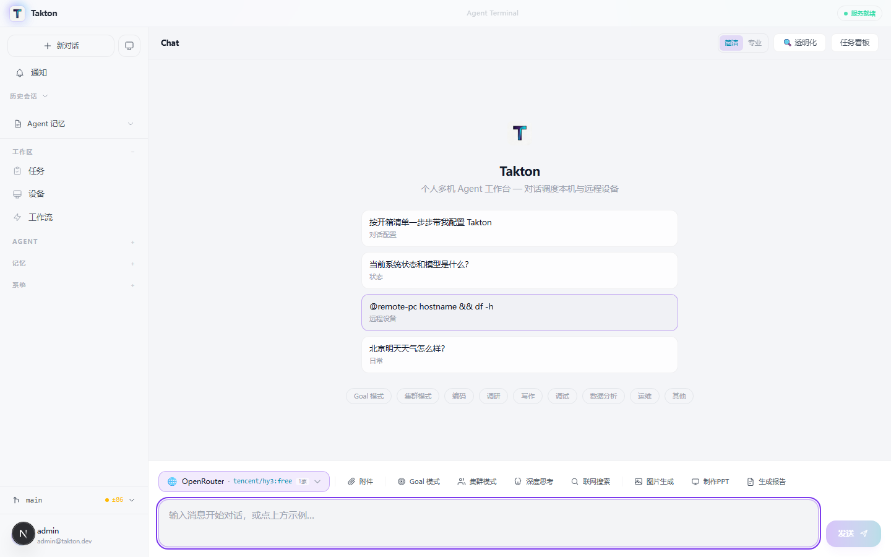
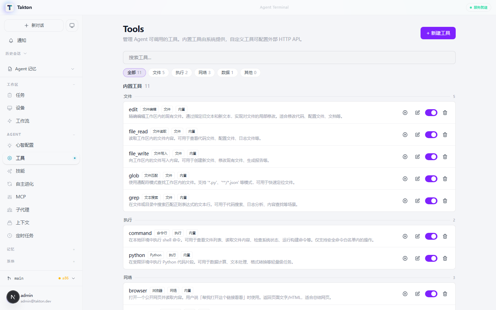
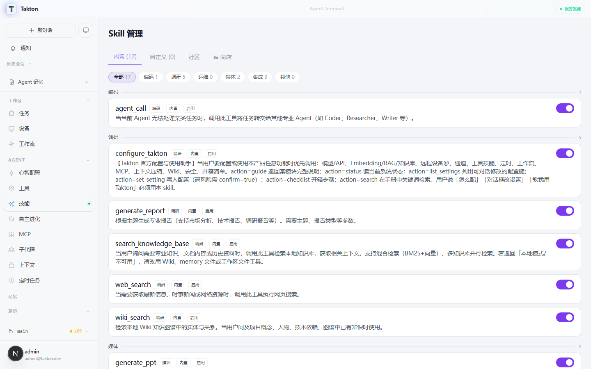
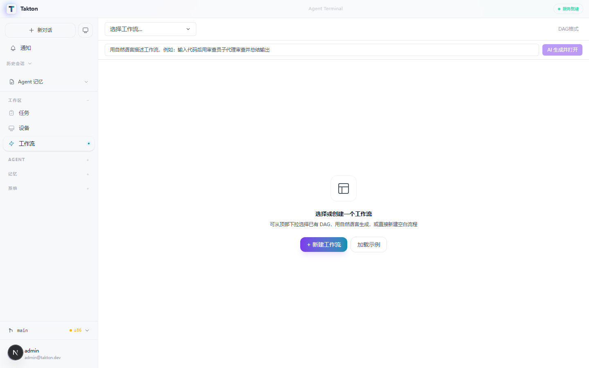
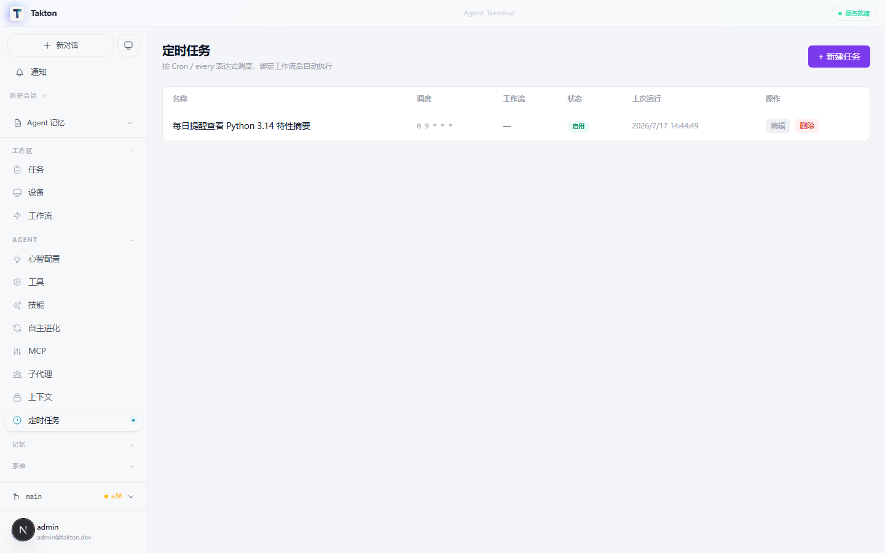
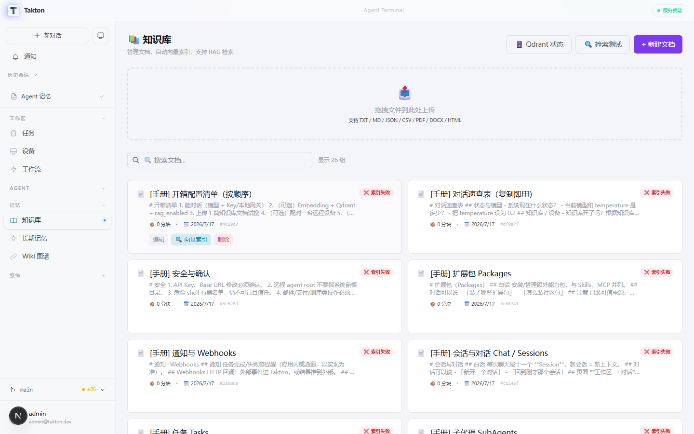
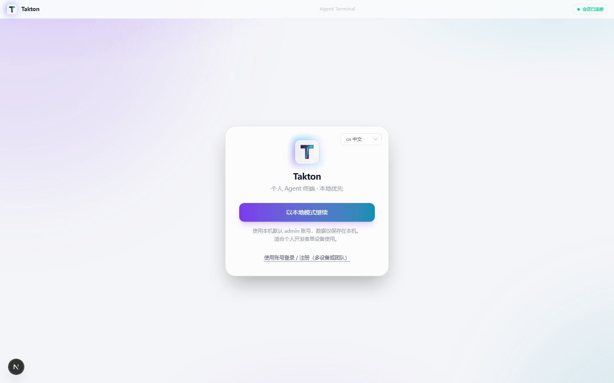
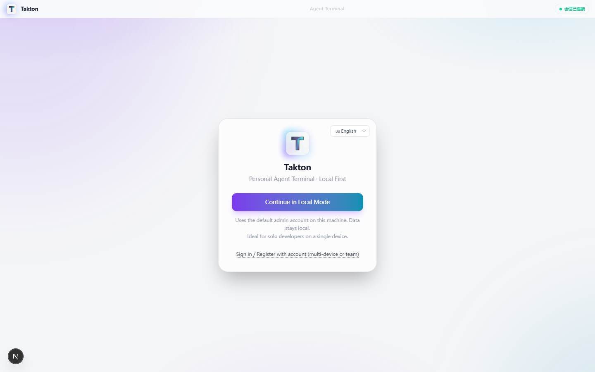

<div align="center">

<br/>


# ⚡ Takton

### Your Personal AI Agent Terminal · 你的专属 AI Agent 终端

**Local-first · Multi-Agent · Skill Auto-Generation · Workflow Orchestration**

**本地优先 · 多 Agent 协作 · 技能自动生成 · 工作流编排**

<br/>

[](https://github.com/wu1w/takton/releases)
[](https://github.com/wu1w/takton/releases)
[](LICENSE)
[](https://github.com/wu1w/takton/stargazers)
[](https://nextjs.org/)
[](https://fastapi.tiangolo.com/)

<br/>

[English](#-features) · [中文](#-核心功能)

</div>

---

## 🎯 Why Takton? · 为什么选择 Takton？

> **Takton is not another chat wrapper.** It's a full-featured agent workstation that runs entirely on your machine — your data never leaves your disk. One agent handles simple questions; a cluster of sub-agents tackles complex research. Skills are not just installed — they're **auto-generated** when the agent encounters a new task type.
>
> **Takton 不是又一个聊天套壳。** 它是一个全功能 Agent 工作站，完全运行在你的本机——数据永远不离开你的磁盘。简单问题单 Agent 搞定；复杂调研自动拆分给子代理集群。技能不只是安装——遇到新任务类型时 Agent 会**自动编写新技能**。

<table>
<tr>
<td width="50%">

### 🧠 Smart Agent Orchestration
Simple questions → single agent. Complex tasks → auto-spawn sub-agent clusters. No manual configuration needed.

### 🔧 Skill Auto-Generation
Agent writes its own tools when it hits a new task type. 17 builtin skills + infinite extensibility.

### 🖥️ OS-Level Operations
File read/write, terminal commands, browser control, SQLite queries — all sandboxed with permission checks.

</td>
<td width="50%">

### 🧠 智能 Agent 编排
简单问题 → 单 Agent。复杂任务 → 自动拆分子代理集群。无需手动配置。

### 🔧 技能自动生成
Agent 遇到新任务类型时自动编写新工具。17 个内置技能 + 无限扩展。

### 🖥️ 操作系统级能力
文件读写、终端命令、浏览器控制、SQLite 查询——全部沙箱化 + 权限校验。

</td>
</tr>
</table>

---

## 📸 Screenshots · 界面预览

<div align="center">

### 💬 Agent Chat · 智能对话


*Multi-session chat with context compression, goal tracking, and tool call visualization*
*多会话管理，支持上下文压缩、目标追踪、工具调用可视化*

### 🔧 Tools & Skills · 工具与技能
 

*63 unified tools (builtin + MCP + custom) with risk-level classification and one-click toggle*
*63 个统一工具（内置 + MCP + 自定义），风险等级分类，一键启停*

### ⚡ Workflows & Cron · 工作流与定时任务
 

*Visual workflow editor with trigger conditions · Cron scheduler with natural language expressions*
*可视化工作流编辑器，支持触发条件 · Cron 调度器，支持自然语言表达式*

### 📚 Knowledge Base · 知识库


*RAG-powered document management with drag-and-drop upload, vector indexing, and hybrid search*
*RAG 驱动的文档管理，支持拖拽上传、向量索引、混合检索*

### 🌐 Bilingual UI · 中英双语
 

*One-click language switch · Full i18n support*
*一键切换中英文 · 完整国际化支持*

</div>

---

## ✨ Features · 核心功能

| Feature | Description | 说明 |
|---------|-------------|------|
| **💬 Multi-Session Chat** | Context compression, goal tracking, breakpoint resume | 多会话管理，上下文压缩，目标追踪，断点续传 |
| **🤖 Sub-Agent Clusters** | Auto-spawn Coder/Researcher/Writer agents for complex tasks | 复杂任务自动拆分给 Coder/Researcher/Writer 子代理 |
| **🔧 Skill System** | 17 builtin skills + auto-generation + community store | 17 个内置技能 + 自动生成 + 社区商店 |
| **⚡ Workflow Engine** | Visual editor, trigger conditions, parallel execution | 可视化工作流编辑器，触发条件，并行执行 |
| **📚 RAG Knowledge Base** | Qdrant vector DB, hybrid search (BM25 + vector) | Qdrant 向量数据库，混合检索（BM25 + 向量） |
| **🔌 MCP Protocol** | Cross-platform tool interop (Claude/Hermes/OpenClaw/Codex) | MCP 协议跨平台工具互通 |
| **⏰ Cron Scheduler** | Natural language cron, workflow binding, webhook triggers | 自然语言定时任务，工作流绑定，Webhook 触发 |
| **🧠 Memory System** | Short-term + long-term memory, Wiki knowledge graph | 短期+长期记忆，Wiki 知识图谱 |
| **🌐 Bilingual UI** | One-click Chinese/English switch, persistent preference | 一键切换中英文，偏好持久化 |
| **🔒 Local-First** | All data stays on your machine, no cloud dependency | 数据全部本地存储，零云端依赖 |

---

## 🚀 Quick Start · 快速开始

### Desktop App (Recommended) · 桌面客户端（推荐）

**Windows**
```powershell
# One-liner install · 一行安装
iex ((irm https://raw.githubusercontent.com/wu1w/takton/main/scripts/install.ps1) -replace '^\uFEFF','')
```

**Linux**
```bash
# One-liner install · 一行安装
curl -fsSL https://raw.githubusercontent.com/wu1w/takton/main/scripts/install.sh | tr -d '\015' | bash
```

**Manual Download · 手动下载**

| Platform | Package | 下载 |
|----------|---------|------|
| Windows | Setup.exe | [Takton-Setup-0.2.4.exe](https://github.com/wu1w/takton/releases/download/v0.2.4/Takton-Setup-0.2.4.exe) |
| Linux | AppImage | [Takton-0.2.4.AppImage](https://github.com/wu1w/takton/releases/download/v0.2.4/Takton-0.2.4.AppImage) |
| Linux | deb | [takton_0.2.4_amd64.deb](https://github.com/wu1w/takton/releases/download/v0.2.4/takton_0.2.4_amd64.deb) |

### From Source · 源码运行

```bash
git clone https://github.com/wu1w/takton.git
cd takton

# One-click start · 一键启动
python start.py

# Or separately · 或分别启动：
# Backend · 后端
pip install -r backend/requirements.txt
python backend/main.py

# Frontend · 前端
cd frontend && npm install && npm run dev
```

Open http://localhost:3000 · 访问 http://localhost:3000

---

## 🛠️ Tech Stack · 技术栈

<div align="center">

| Layer | Technology | 技术 |
|-------|-----------|------|
| **Frontend** | Next.js 16 · React 19 · Tailwind CSS 4 · Electron | Next.js 16 · React 19 · Tailwind CSS 4 · Electron |
| **Backend** | FastAPI · SQLAlchemy 2.0 · SQLite/PostgreSQL | FastAPI · SQLAlchemy 2.0 · SQLite/PostgreSQL |
| **AI/LLM** | OpenAI-compatible API · MCP Protocol · RAG | OpenAI 兼容 API · MCP 协议 · RAG |
| **Vector DB** | Qdrant (optional) | Qdrant（可选） |
| **i18n** | Zustand persist · Custom translation engine | Zustand persist · 自研翻译引擎 |
| **Deploy** | Electron Builder · Docker (optional) | Electron Builder · Docker（可选） |

</div>

---

## 🏗️ Architecture · 架构

```
┌─────────────────────────────────────────────────────┐
│                   Electron Shell                     │
│  ┌─────────────────────────────────────────────────┐ │
│  │              Next.js 16 Frontend                 │ │
│  │  ┌─────────┐ ┌─────────┐ ┌──────────────────┐  │ │
│  │  │  Chat   │ │  Tools  │ │  Workflow Editor │  │ │
│  │  └────┬────┘ └────┬────┘ └────────┬─────────┘  │ │
│  │       └────────────┴────────────────┘           │ │
│  │                    │ WebSocket                   │ │
│  └────────────────────┼─────────────────────────────┘ │
│                       │                               │
│  ┌────────────────────┼─────────────────────────────┐ │
│  │              FastAPI Backend                     │ │
│  │  ┌─────────┐ ┌─────────┐ ┌──────────────────┐  │ │
│  │  │ Agent   │ │ Tool    │ │  Cron Scheduler  │  │ │
│  │  │ Loop    │ │ Registry│ │                  │  │ │
│  │  └────┬────┘ └────┬────┘ └────────┬─────────┘  │ │
│  │       └────────────┴────────────────┘           │ │
│  │                    │                             │ │
│  │  ┌─────────────────┼─────────────────────────┐  │ │
│  │  │    SQLite / PostgreSQL + Qdrant           │  │ │
│  │  └───────────────────────────────────────────┘  │ │
│  └─────────────────────────────────────────────────┘ │
└─────────────────────────────────────────────────────┘
```

---

## 📖 Documentation · 文档

- [Technical Manual · 技术手册](docs/TECHNICAL_MANUAL.md) — Architecture, API, Database design
- [AGENTS.md](AGENTS.md) — AI coding assistant configuration guide

---

## 🤝 Contributing · 贡献

We welcome Issues and Pull Requests! 

欢迎提交 Issue 和 Pull Request！

If Takton helps you, please give us a ⭐ — it means the world to us!

如果 Takton 对你有帮助，请给我们一个 ⭐ — 这对我们意义重大！

---

## 📄 License · 许可证

MIT License — see [LICENSE](LICENSE) for details.

---

<div align="center">

**Takton** — Let AI be your dedicated work partner 🎯

**Takton** — 让 AI 成为你的专属工作伙伴 🎯

[⭐ Star us on GitHub](https://github.com/wu1w/takton) · [🐛 Report Bug](https://github.com/wu1w/takton/issues) · [💡 Request Feature](https://github.com/wu1w/takton/issues)

</div>
